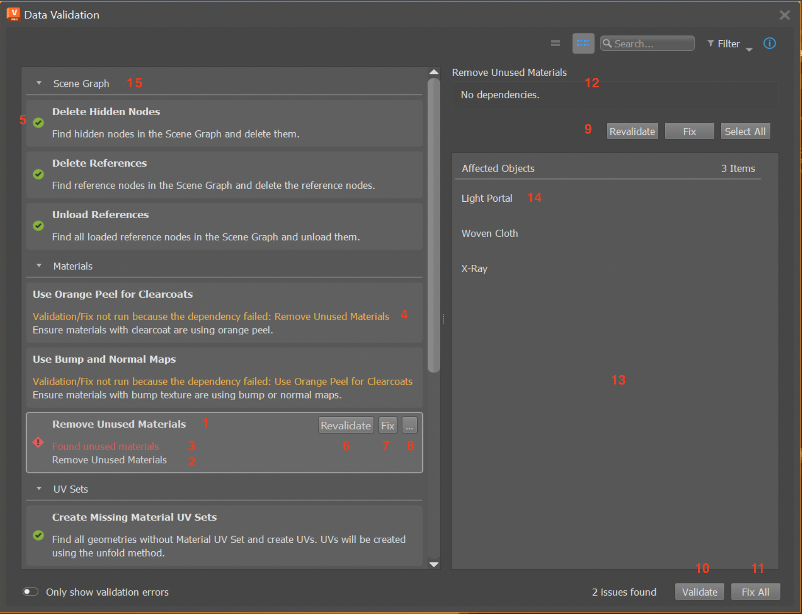

.. _getting-started:

Getting Started
====================

The Data Validation App (DVA) is a Toolkit App that can be set up to be used with any DCC. It provides a flexible framework to validate the data within a DCC, according to the :ref:`validation-rule-set` that you define.

 Here are the steps to get started with the app:
    1. :ref:`engine-setup`
    2. :ref:`engine-setup-hook`
    3. :ref:`engine-setup-override-hook`
    4. :ref:`engine-setup-define-rule-callbacks`
    5. :ref:`engine-setup-config-add-rules`

Refer back to :ref:`using-data-validation-app` for more details about the app's functionality and how it works.

.. _engine-setup:

Adding Data Validation to the Engine
--------------------------------------------

The DVA must be run within an Engine. The app can be added to an Engine using the config, as like any other Toolkit App:

.. code-block:: yaml
    :caption: Example: VRED Engine config settings file *tk-vred.yml*

    settings.tk-vred.asset_step:
      apps:
        tk-multi-data-validation: "@settings.tk-multi-data-validation.vred"

To start validating your DCC's data, the Engine must be set up to support the data validation workflow. See next steps in :ref:`engine-setup-hook` on how to modify the Engine.

For Engines that have already been set up, see :ref:`validation-customization` on how to modify the validation to your specific needs.

.. _engine-setup-hook:

Setting Up the Data Validation Hook
^^^^^^^^^^^^^^^^^^^^^^^^^^^^^^^^^^^^^^^^^^^^

The DVA requires information from the Engine to determine how it will display and perform the data validation. This information is retrieved using the :ref:`validation-hooks-data-validation`. The DVA config settings must be modified to specify the ``hook_data_validation`` file that the Engine will use to implement the hook methods:

.. code-block:: yaml
    :caption: Example: Data Validation App config settings file *tk-multi-data-validation.yml*

    settings.tk-multi-data-validation.vred:
      location: "@apps.tk-multi-data-validation.location"
      hook_data_validation: "{engine}/tk-multi-data-validation/basic/data_validation.py"

.. _engine-setup-override-hook:

Defining the Validation Rule Set
^^^^^^^^^^^^^^^^^^^^^^^^^^^^^^^^^^^^^^^^^^^^

The DVA performs the validation on the data in the DCC by using a :ref:`validation-rule-set`. The DVA itself is not DCC specific, and thus does not define the validation rule set. The responsibility is on the Engine (which is DCC specific) to establish this rule set.

In the previous step, the Engine's :ref:`validation-hooks-data-validation` file was set up. Now in the hook file, we need to implement the hook method :class:`get_validation_data <hooks.data_validation.AbstractDataValidationHook.get_validation_data>` to return the validation rule set. See the example below on how to override this hook method:

.. code-block:: python
    :caption: Example: VRED Engine hook file *data_validation.py*

        import sgtk
        HookBaseClass = sgtk.get_hook_baseclass()

        class VREDDataValidationHook(HookBaseClass):
            """Subclass the base tk-multi-data-validation hook class AbstractDataValidationHook."""

            def get_validation_data(self):
                """Override the base hook method to return the VRED Validation Rule Set."""

                return {
                    "delete_hidden_nodes": {
                        "name": "Delete Hidden Nodes",
                        "description": "Find and delete all hidden nodes in the scene.",
                        "check_func": find_hidden_nodes,
                        "fix_func": do_delete_hidden_nodes,
                        "actions": [
                            {
                                "name": "Select All Hidden Nodes",
                                "callback": select_nodes
                            }
                        ],
                        "item_actions": [
                            {
                                "name": "Select Node",
                                "callback": select_node
                            }
                        ],
                    }
                }

This is a simple example where there is only one rule in the set. The rule id is ``delete_hidden_nodes`` and the data for the rule is in the key-value dictionary. More rules can be added by adding more items to the dictionary. The supported rule data key-values:

    - ``name``: (str) The rule display name
    - ``description``: (str) The rule descriptive text
    - ``check_func``: (function) The rule validate callback function, applied to all data
    - ``fix_func``: (function) The rule fix callback function, applied to all data
    - ``actions``: (List[dict]) A list of action callback functions, applied to all data. Item key-values: name (str): the action name, callback (function): the callback function
    - ``item_actions``: (List[dict]) A list of action callback functions, applied to single afected object. Item key-values: name (str): the action name, callback (function): the callback function
    - ``check_name``: (str) The validate button text label
    - ``fix_name``: (str) The fix button text label
    - ``fix_tooltip``: (str) Text to display on hovering over the fix button
    - ``error_msg``: (str) Text that describes why the data is not valid
    - ``warn_msg``: (str) Text that describes warnings for this rule
    - ``kwargs``: (function) A function that returns a dictionary to pass as key-word arguments to fix and action callbacks
    - ``dependcy_ids``: (List[str]) A list of rule ids which this rule depends on

.. _engine-setup-define-rule-callbacks:

Defining Validation Rule Callbacks
^^^^^^^^^^^^^^^^^^^^^^^^^^^^^^^^^^^^^^^^^^^^

Each validation rule defined in the :ref:`validation-rule-set` dictionary may specify callback functions:

    - ``check_func``: callback to validate the data by this rule (see :ref:`validation-rule-check-func`)
    - ``fix_func``: callback to fix the data by this rule (see :ref:`validation-rule-fix-func`)
    - ``actions``: callbacks to execute on all of the :ref:`validation-affected-objects` for this rule (see :ref:`validation-rule-actions`)
    - ``item_actions``: callbacks to execute on a single :ref:`Affected Object <validation-affected-objects>` for this rule (see :ref:`validation-rule-item-actions`)

These callback functions can be implemented as hook methods; for example, these are the functions to implement to make the ``delete_hidden_nodes`` rule effective:

.. code-block:: python
    :caption: Example: Hook methods for VRED rule *delete_hidden_nodes*

        class VREDDataValidationHook(HookBaseClass):
            """Subclass the base tk-multi-data-validation hook class AbstractDataValidationHook."""

            #
            # other class methods omitted
            #

            def find_hidden_nodes(self):
                """Implement the check function for the delete hidden nodes rule."""

            def do_delete_hidden_nodes(self, errors=None):
                """Implement the fix function for the delete hidden nodes rule."""

            def select_nodes(self, errors=None):
                """Implement the select action function for the delete hidden nodes rule."""

            def select_node(self, errors=None):
                """Implement the select item action function for the delete hidden nodes rule."""

The purpose of the rule's ``check_func`` is to validate the current data according to some criteria. For example, the ``delete_hidden_nodes`` check function ``find_hidden_nodes`` method should look for hidden nodes in VRED and return the list of hidden node objects that were found:

.. code-block:: python
    :caption: Example: Check function for *delete_hidden_nodes*

        def find_hidden_nodes(self):
            """
            Find hidden nodes in VRED.

            :return: A list of hidden nodes.
            :rtype: List[vrdNode]
            """

            # Assume the find_nodes function exists and returns a list VRED node objects
            return find_nodes(hidden=True)

Notice that ``find_hidden_nodes`` returns a list of VRED objects. The DVA does not have any knowledge of VRED objects, so it will call the hook method
:class:`sanitize_check_result <hooks.data_validation.AbstractDataValidationHook.sanitize_check_result>` to convert the list of VRED objects into a standardized format, which it can handle. For example, the VRED Engine overrides this hook method:

.. code-block:: python
    :caption: Example: VRED Engine override hook method ``sanitize_check_result``

        class VREDDataValidationHook(HookBaseClass):
            """Subclass the base tk-multi-data-validation hook class AbstractDataValidationHook."""

            def sanitize_check_result(self, result):
                """
                Return the check result in the Data Validation standardized format.

                :param result: A result returned by any of the VRED rule check functions.
                :type result: We expect it to be a list of VRED objects
                """

                # The result is the value returned by a check function, which is expected to be
                # the list of error objects found. So this check result is valid if the
                # result is an empty list, or None.
                #
                # NOTE: you may want to put in some safe guards against the result data
                # passed to the method to ensure it is in the format you expect
                valid = not result

                # Gather the list of errors from the result and put it into the DVA format
                # NOTE: VRED objects have the attributes getObjectID, getName, getType
                errors = []
                for item in result:
                    error_item = {
                        "id": item.getObjectID(),
                        "name": item.getName(),
                        "type": item.getType()
                    }
                    errors.append(error_item)

                # The DVA expects a dictionary with key-values:
                #   - is_valid (bool): True if result passed the check, else False
                #   - errors (List[dict]): The errors found by the check
                #       Each error item with keys-values:
                #         - id (str|int): Unique identifier for the error object
                #         - name (str): Display name for the error object
                #         - type (str): Display name for the error object type (optional)
                return {
                    "is_valid": valid,
                    "errors": errors
                }

Now that the rule's :ref:`validation-rule-check-func` is implemented, and the result is sanitized for the DVA to handle, the rule's :ref:`validation-rule-fix-func` needs to be implemented next:

.. code-block:: python
    :caption: Example: Fix function for *delete_hidden_nodes*

        def do_delete_hidden_nodes(self, errors=None):
            """
            Delete the given error objects, which are hidden nodes.

            The errors passed in will be the same errors as returned by the check function
            ``find_hidden_nodes`` and sanitized by the ``sanitize_check_result`` function.

            So for example if ``find_hidden_nodes`` returned:

                [node_1, node_2]

            , then the sanitize method would yield:

                {
                    "is_valid": False,
                    "errors": [
                        {
                            "id": node_1_id,
                            "name": "Node 1",
                            "type": vrdNode
                        },
                        {
                            "id": node_2_id,
                            "name": "Node 2",
                            "type": vrdNode
                        }
                    ]
                }

            , and so the ``errors`` key value in the dict of the sanitized result is the
            value passed to this function:

                    [
                        {
                            "id": node_1_id,
                            "name": "Node 1",
                            "type": vrdNode
                        },
                        {
                            "id": node_2_id,
                            "name": "Node 2",
                            "type": vrdNode
                        }
                    ]

            If no errors are given, we will interpret this as delete all hidden nodes.

            :param errors: The hidden nodes to delete. If None, delete all hidden nodes.
            :type errors: List[dict] | None
            """

            if errors is None:
                # No errors provided, find all hidden nodes to delete
                nodes = find_hidden_nodes()
            else:
                # Errors are provided, gather the node objects from the error data
                # Assume the get_node_by_id function exists and returns the node object for the given id
                nodes = []
                for error_data in errors:
                    node = get_node_by_id(error_data["id"])
                    nodes.append(item)

            # Delete the hidden nodes found. Assume the delete_node function exists.
            for node in nodes:
                delete_node(n)

Finally, the action and item action functions need to be implemented. These functions are called in the same way that the :ref:`validation-rule-fix-func` is called with the list of errors:

.. code-block:: python
    :caption: Hook methods for *delete_hidden_nodes*

        def select_nodes(self, errors=None):
            """
            Select the given nodes.

            :param errors: The list of nodes to select.
            :type errors: List[dict]
            """"

            # Don't select anything unless specified
            if not errors:
                return

            # Errors are provided, gather the node objects from the error data
            # Assume the get_node_by_id function exists and returns the node object for the given id
            nodes = []
            for error_data in errors:
                node = get_node_by_id(error_data["id"])
                nodes.append(item)

            # Select the nodes in VRED
            vred_select_nodes(nodes)

        def select_node(self, errors=None):
            """
            Select the given node.

            TODO double-check this

            :param errors: A list containing a single node.
            :type errors: List[dict]
            """"

            self.select_nodes(errors)

.. _engine-setup-config-add-rules:

Displaying Validation Rules in the App
^^^^^^^^^^^^^^^^^^^^^^^^^^^^^^^^^^^^^^^^^^^^

The :ref:`validation-rule-set` returned by the ``get_validation_data`` method defines all of the available rules that can be added to the app. To have these rules show up in the DVA, the app config settings file must be updated:

.. code-block:: yaml
    :caption: tk-multi-data-validation.yml

    settings.tk-multi-data-validation.vred:
      location: "@apps.tk-multi-data-validation.location"
      hook_data_validation: "{engine}/tk-multi-data-validation/basic/data_validation.py"
      rules:
        - id: delete_hidden_nodes

If we wanted to hide the ``delete_hidden_nodes`` rule and not show in the app, we can remove the ``- id: delete_hidden_nodes`` line from the config. See :ref:`data-validation-settings` for more details about the tk-multi-data-validation.yml settings file.

Mapping Validation Rule Fields to the User Interface
---------------------------------------------------------------

To help visualize and understand what each of the fields in the :ref:`validation-rule-set` affect, here is a mapping of the user interface elements to the rule set dictionary fields:

**1. Validation rule**

    The highlighted item in the view is a :ref:`validation-rule-item`. All rules in the view make up the :ref:`validation-rule-set`. The rule's display name and is set by the ``name`` field.

**2. Validation rule description**

   This is the rule's descriptive text and is set by the ``description`` field.

**3. Validation rule error message**

    This is the rule's error message. Error messages are shown when the rule's :ref:`validation-rule-check-func` has failed. The ``error_msg`` field will be appended to rule's error message.

**4. Validation rule warning message**

    This is the rule's warning message. Warning messages are always shown (in yellow). The ``warn_msg`` field will be appended to rule's warning message.

**5. Validation rule status icon**

   This is the rule's validation status from the last time its :ref:`validation-rule-check-func` ran. The status is determined by running the function set by the ``check_func`` field.

**6. Validate rule button**

   Clicking this button will validate the data according to the rule's criteria. The validation is performed by calling the function set by the ``check_func`` field, which is referred to as the :ref:`validation-rule-check-func`. The button text is set by the ``check_name`` field.

**7. Fix rule button**

   Clicking this button will fix the data according to the rule. The fix is performed by calling the function set by the ``fix_func`` field, which is referred to as the :ref:`validation-rule-fix-func`. The button text is set by the ``fix_name`` field.

**8. Rule actions button menu**

   Clicking this button will pop up the actions menu for the rule. The list of menu actions are set by the ``actions`` field, which are referred to as the rule's :ref:`validation-rule-actions`. Clicking on any of the menu actions will call that particular action callback function. The actions menu can also be opened by right-clicking on the rule item in the view, or clicking the button from the details panel.

**9. Details panel**

    The details panel will show more information for the currently select rule in the view. The row of buttons are function the same as the buttons on the rule item in the view. They will be shown in this order: validate button, fix button, all action buttons. See the particular button descriptions above for which fields affect these buttons.

**10. Validate all button**

    Clicking this button will run each of the rule's own :ref:`validation-rule-check-func`. The check function is set by the ``check_func`` field.

**11. Fix all button**

    Clicking this button will run each of the rule's own :ref:`validation-rule-fix-func`. The fix function is set by the ``fix_func`` field.

**12. Details panel information**

    This is the currently selected rule's detailed information. The details indicate that the rule in the example has no dependencies. The rule dependencies are set by the ``dependency_ids`` field. Dependencies determine the order in which rules are validated and fixed.

**13. Details panel affected objects**

    The view lists the :ref:`validation-affected-objects` after validating the current data by the rule. These are essentially data errors found by running the rule's :ref:`validation-rule-check-func`.

**14. Affected object item**

    An :ref:`affected object <validation-affected-objects>` is an error found by running the rule's :ref:`validation-rule-check-func`. Right click the item to see the list of :ref:`validation-rule-item-actions` set by the ``item_actions`` field. Hover over the item to see the first item action. Click any of the item actions to call the corresponding callback function.

**15. Rule grouping**

    This is a grouping of rules. A rule's group is set by the ``data_type`` field, which can also be set in the app :ref:`data-validation-settings`.
