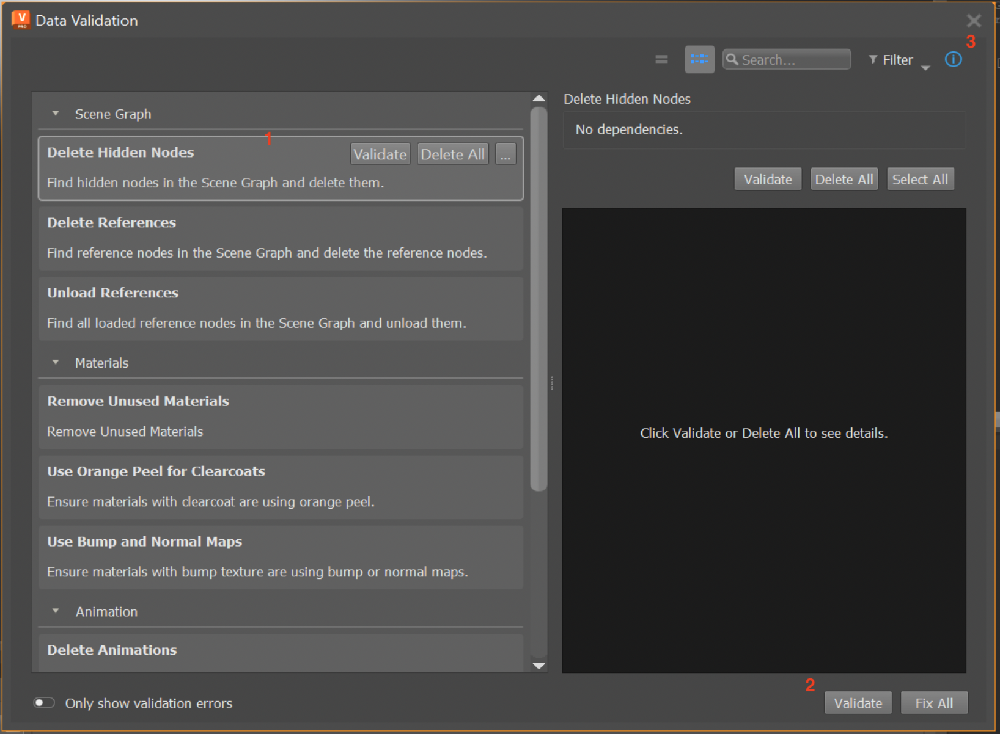
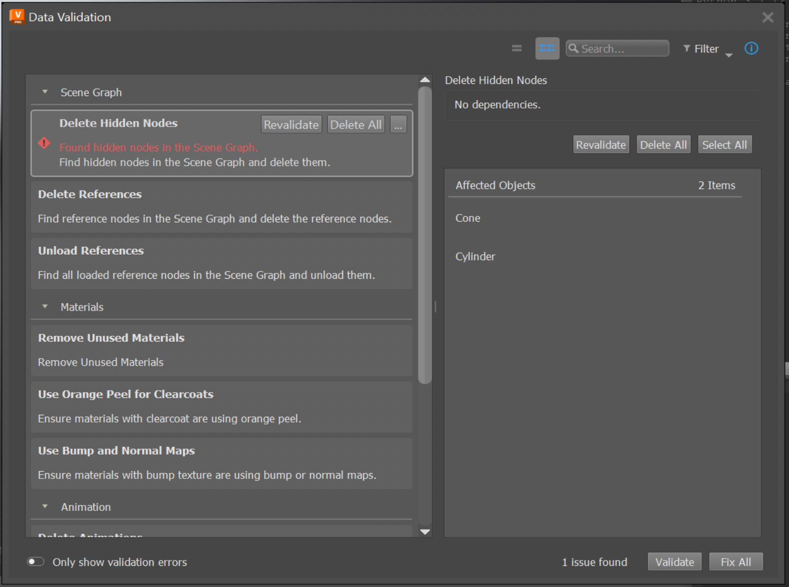
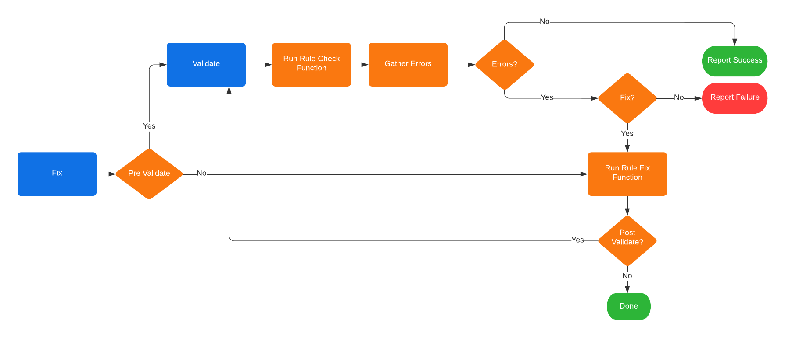
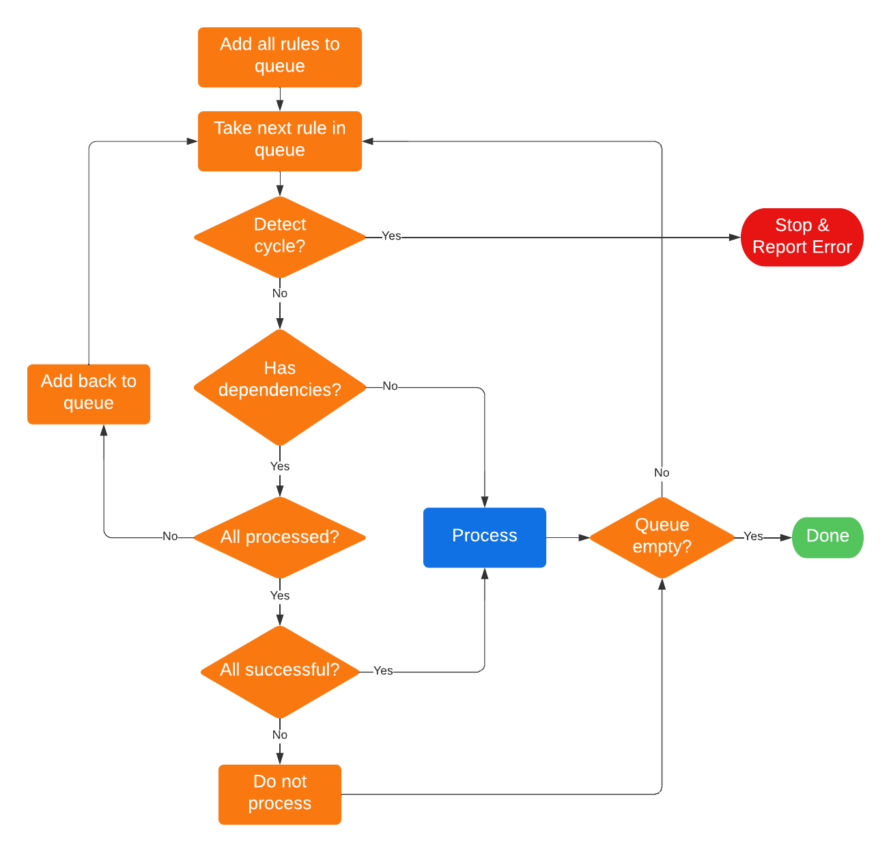
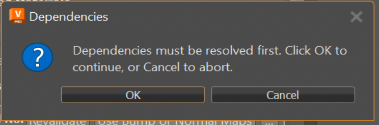

.. _using-data-validation-app:

Using the Data Validation App
========================================

The purpose of Data Validation App (DVA) is to validate the current DCC data accoding to a :ref:`validation-rule-set`, report any discepancies to the user, and provide the actions to modify the data to be compliant.

This is the app being used in VRED. To point out a few basics:

**1. A Validation Rule Item**

The main app view displays the list of available validation rules. A :ref:`validation-rule-item` defines how the data is evaluated to determine if the data is in the desired format; if this evaluation step can be automated, then the rule will provide a validate action. The rule may also provide a fix action, which will modify the data to be compliant to the rule's validation.

**2. Validate and Fix All Actions**

Clicking the **"Validate"** button will execute the validate action for each of the validation rules. The status for each rule will be reported by displaying an icon to indicate success, errors or warnings. Additionally error and/or warning messages will be displayed, if applicable. Similarly, clicking the **"Fix All"** button will execute the fix action for each of the validation rules. The order in which the rule's are validated and fixed is determined by the :ref:`rule-dependencies`.

**3. The Details Panel**

The Details Panel can be shown by clicking the "i" button, or by right-clicking a rule item and selecting "Show Details". The details panel will show additional information about the currently selected rule. After executing the rule's validate action, any data that does not comply with the validation will be gathered and displayed as the **Affected Objects** in the details panel. The details panel will also provide convenience buttons to validate, fix and apply other actions for the currently selected rule (these are the same buttons as shown on hovering over a rule in the main view).

.. _understanding-validation:

Understanding How Data is Validated and Fixed
------------------------------------------------

The current data in the DCC can be validated by all rules at once, or by a single rule. In either case, when the data is validated by a rule, the app calls the rule's :ref:`validation-rule-check-func` to gather any data that is not compliant with the rule. The status for each rule will be reported, as well as any discrepancies that were found. Similarly for fixing, the data can be fixed by all rules once, or by a single rule. In either case, when the data is fixed by a rule, the app will call the rule's :ref:`validation-rule-fix-func`.

When fixing the data, the app will by default pre-validate the data to check if data needs to be fixed. This will prevent the fix action from executing, if there is no issue in the first place. As well by default, the app will post-validate the data to check that the data was fixed correctly. This will ensure that the status is reported for a rule after its fix is applied.

.. _rule-dependencies:

Rule Dependencies
^^^^^^^^^^^^^^^^^^^^^

A validation rule may require another rule to be applied to the data before its own validation and fix can be applicable. For example, let's say we have ``rule_1`` that checks for hidden nodes and fixes the data by deleting those hidden nodes, and ``rule_2`` that checks for nodes without a shader assigned and fixes the data by assigning a default shader. If ``rule_2`` is validated before ``rule_1``, then we could find a node, call it ``node_1``, that does not have a shader assigned but is also hidden. Finding ``node_1`` is not wrong, but if the fix for ``rule_2`` is applied before ``rule_1``, then we will do the work to assign a shader to the node but the node will eventually be deleted once the fix for ``rule_1`` is applied. In this example, it is only time that is wasted, but potentially there are other cases where the fix for ``rule_2`` can modify the data in a way that is undesirable because ``rule_1`` was not applied first.

The above example demonstrates the concept of rule dependencies; when a rule's validation or fix depends on another rule to be applied first. These dependencies affect the order in which rules are validated and fixed. Rules are processed sequentially, as they appear top to bottom in the app's view, but a rule will only be processed if all of its dependencies have been processed and were successful. This would mean, from our example before, ``rule_2`` depends on ``rule_1``, so the data will not be validated or fixed by ``rule_2`` until ``rule_1`` has been validated and fixed. From the previous diagram, dependcies are dealt with at the **"For Each Rule"** step as shown below:

Notice that a rule will not be validated or fixed if any of its dependencies were not successfully processed. In this case, a warning message will be displayed indicating which dependency failed that caused the rule not to be processed.

When fixing by a single rule that has dependencies, a dialog will pop up to inform the user that the rule has dependencies ans they must be applied first before running the selected rule's fix. This is to ensure the user knows that their data may be modified by another rule which they did not explicitly ask to do.

